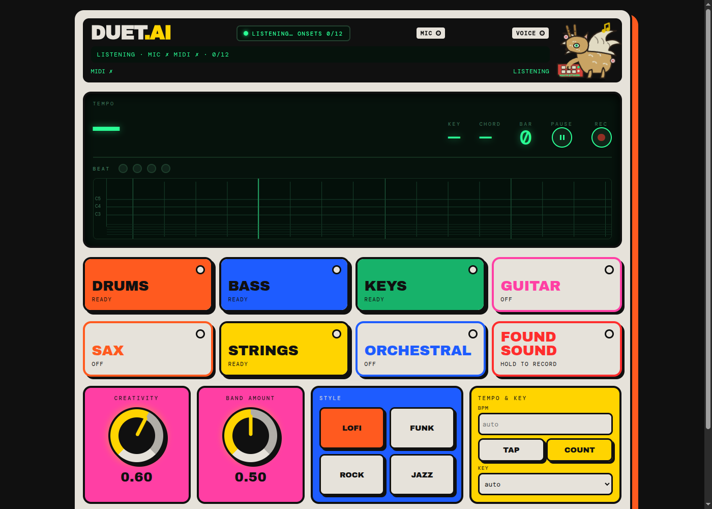

# duet.ai

A band in the browser that plays along with you. Hum, sing, play into the mic or a MIDI keyboard; after four bars it locks onto your tempo and key and plays drums, bass, keys and lead. Toggle instruments, switch genre, turn the Creativity knob.

Live: https://www.duetai.art



## Run locally

macOS or Linux, Node 18+:

```sh
scripts/run-local.sh            # http://localhost:8088/backline/, hosted relay
scripts/run-local.sh --relay    # also runs the relay on :8787 (needs GEMINI_API_KEY)
npm test                        # vitest, no audio needed
```

Patterns works offline. `--relay` reads `GEMINI_API_KEY` from the environment or `~/.local/secrets/gemini.env`, plus `ACESTEP_UPSTREAM` / `AMT_UPSTREAM` if set.

## How it works

```
mic / MIDI  →  Listener  →  { bpm, key, chord, notes }  →  BandEngine  →  audio
```

- **Listener** (`src/listener/`): onset detection, pitch tracking, tempo lock, key and chord detection.
- **Engines** (`src/engines/`): one interface, four implementations, switchable on the panel.
- **Relay** (`relay/`): Cloudflare Worker holding the API key and pod URLs; origin-gated, rate-limited, no accounts.

| Engine | Runs | Control latency |
|---|---|---|
| Patterns | browser, Tone.js | next bar |
| Lyria | Google Lyria RealTime via relay | ~0.5 s |
| ACE | ACE-Step 1.5 on a GPU pod via relay | next 2-bar block |
| AMT | Anticipatory Music Transformer on the pod via relay | per bar, note-following |

## Run your own GPU

The ACE-Step and AMT engines run on a GPU pod we pay for; when it is off, the app plays its offline Patterns band. Anyone can run the models themselves and point the live app at them, no relay involved:

1. Rent a pod on RunPod (an L40S or 4090 class card, 40 GB disk, ports 8080 and 8081 exposed as HTTP) with the `runpod/pytorch` image and your SSH key.
2. Bootstrap it: `scp services/pod-bootstrap.sh root@<pod>:/root/ && ssh root@<pod> bash /root/pod-bootstrap.sh` (ACE-Step on 8080, AMT on 8081; `services/DEPLOYED.md` has the details).
3. On www.duetai.art open **Models & connection → Your own GPU** and paste the pod id (e.g. `6r2srn274qynf1`) into the ACE-Step and/or AMT field. A host or a full `wss://…/ws` URL works too, so any machine that runs `services/acestep/server.py` or `services/amt/server.py` will do.

The setting lives in your browser only. Clear the field to go back to the hosted relay.

## Deploy

Push to `main` deploys the app to Cloudflare Pages (duetai.art) and GitHub Pages (shylenko.com/backline/). Other branches preview at `https://<branch>.backline-88n.pages.dev`. Relay: `cd relay && npm run deploy`. GPU services: `services/README.md`.

## More

- [Hardware I/O: LYDIA morph output, mic and MIDI device pickers](docs/hardware-io.md)
- [Raspberry Pi pedal edition](services/pi/README.md) (`npm run build:pi`)
- Extend: new genre in `src/patterns/`, new engine implements `BandEngine` in `src/engines/engine.ts`.

## Licences

MIT. Tone.js MIT. ACE-Step 1.5 MIT. Magenta RealTime 2 weights CC-BY-4.0 if used.
