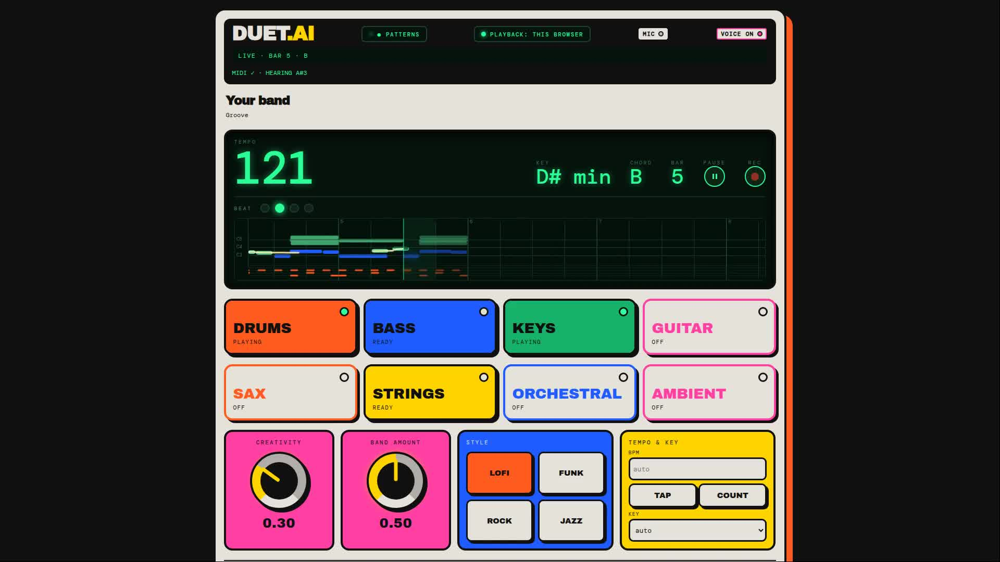
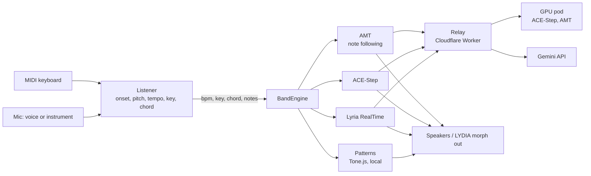

# duet.ai

A band in the browser that plays along with you. Hum, sing, play into the mic or a MIDI keyboard; after four bars it locks onto your tempo and key and plays drums, bass, keys and lead. Toggle instruments, switch genre, turn the Creativity knob.

[](https://github.com/w1ne/duet.ai/actions/workflows/deploy.yml)

## Hackathon

Built for the Music & AI Hackathon 2026 (Uttendorf/Rudolfshütte, 12–13 Sep 2026),
Challenge 2: AI Instruments & Beyond Music.

Team: [Andrii Shylenko](https://github.com/w1ne), [Fabian Schuller](https://github.com/fabsch225),
[Nafisa A](https://github.com/naf-athiya), Liz Shch, [Weronika Z](https://github.com/werka-z),
[Aboutsue](https://github.com/Aboutsue).

Live app: https://www.duetai.art
Demo video: https://github.com/w1ne/duet.ai/releases/download/hackathon-2026-demo/duetai-demo.mp4
Submission text: [docs/hackathon-submission.md](docs/hackathon-submission.md)



## Two editions

- **Browser app.** Runs anywhere, uses the laptop's mic/MIDI and speakers. See below.
- **LYDIA pedal.** A standalone build for a Raspberry Pi built into a Roland/Neutone LYDIA
  pedal, using the pedal's own audio I/O, knobs, footswitches and LCD. It auto-updates from
  the rolling `pi-latest` GitHub release every 2 minutes. See [services/pi/README.md](services/pi/README.md).

## Run locally

macOS or Linux, Node 18+:

```sh
scripts/run-local.sh            # http://localhost:8088/backline/, hosted relay
scripts/run-local.sh --relay    # also runs the relay on :8787 (needs GEMINI_API_KEY)
npm test                        # vitest, no audio needed
```

Patterns works offline. `--relay` reads `GEMINI_API_KEY` from the environment or `~/.local/secrets/gemini.env`, plus `ACESTEP_UPSTREAM` / `AMT_UPSTREAM` if set.

## How it works



The same code runs in the browser and on the LYDIA pedal (Raspberry Pi, ALSA audio, LCD, knobs, footswitches).

- **Listener** (`src/listener/`): onset detection, pitch tracking, tempo lock, key and chord detection.
- **Engines** (`src/engines/`): one interface, four implementations, switchable on the panel.
- **Relay** (`relay/`): Cloudflare Worker holding the API key and pod URLs; origin-gated, rate-limited, no accounts.

| Engine | Runs | Control latency |
|---|---|---|
| Patterns | browser, Tone.js | next bar |
| Lyria | Google Lyria RealTime via relay | ~0.5 s |
| ACE | ACE-Step 1.5 on a GPU pod via relay | next 2-bar block |
| AMT | Anticipatory Music Transformer on the pod via relay | per bar, note-following |

## Deploy

Push to `main` deploys the app to Cloudflare Pages (duetai.art) and GitHub Pages (shylenko.com/backline/). Other branches preview at `https://<branch>.backline-88n.pages.dev`. Relay: `cd relay && npm run deploy`. GPU services: `services/README.md`.

## More

- [Hardware I/O: LYDIA morph output, mic and MIDI device pickers](docs/hardware-io.md)
- [Raspberry Pi pedal edition](services/pi/README.md) (`npm run build:pi`)
- Extend: new genre in `src/patterns/`, new engine implements `BandEngine` in `src/engines/engine.ts`.

## Licences

MIT. Tone.js MIT. ACE-Step 1.5 MIT. Magenta RealTime 2 weights CC-BY-4.0 if used.
